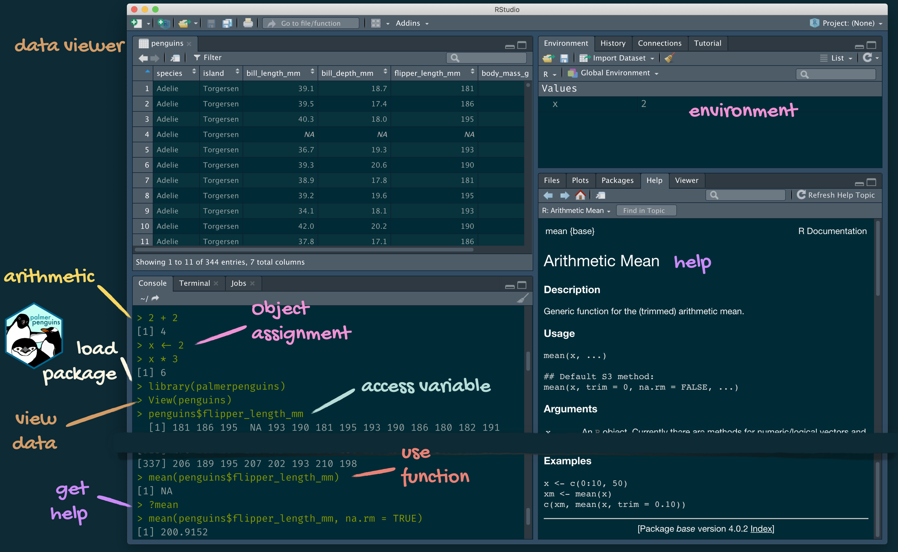

```{r child = "setup.Rmd"}
```

```{r xaringan-tile-view, echo=FALSE}
xaringanExtra::use_tile_view()
```

```{r xaringan-editable, echo=FALSE}
xaringanExtra::use_editable(expires = 1)
```

```{r xaringan-panelset, echo=FALSE, message=FALSE, warning=FALSE}
xaringanExtra::use_panelset()
xaringanExtra::style_panelset_tabs(panel_tab_font_family = "sans-serif")
```

```{r xaringanExtra-clipboard, echo=FALSE}
htmltools::tagList(
  xaringanExtra::use_clipboard(
    button_text = "<i class=\"fa fa-clipboard\"></i>",
    success_text = "<i class=\"fa fa-check\" style=\"color: #90BE6D\"></i>",
    error_text = "<i class=\"fa fa-times-circle\" style=\"color: #F94144\"></i>"
  ),
  rmarkdown::html_dependency_font_awesome()
)
```

```{r xaringan-fit-screen, echo=FALSE}
xaringanExtra::use_fit_screen()
```

```{r xaringan-extra-styles, echo=FALSE}
xaringanExtra::use_extra_styles(
  hover_code_line = TRUE,         #<<
  mute_unhighlighted_code = TRUE  #<<
)
```

```{css include=FALSE}
.panelset {
   --panel-tab-foreground: currentColor;
   --panel-tab-background: unset;
   --panel-tab-active-foreground: currentColor;
   --panel-tab-active-background: unset;
   --panel-tab-active-border-color: currentColor;
   --panel-tab-hover-foreground: currentColor;
   --panel-tab-hover-background: unset;
   --panel-tab-hover-border-color: currentColor;
   --panel-tab-inactive-opacity: 0.5;
   --panel-tabs-border-bottom: #ddd;
   --panel-tab-font-family: Sen;
   --panel-tab-background-color-active: #fffbe0;
   --panel-tab-border-color-active: #023d4d;
}

.panelset .panel-tabs .panel-tab > a {
	color: #023d4d;
}

.panelset .panel-tabs {
  font-size: 0.5rem;
}
```


## Grupos de trabalho?

.hand[
.pull-left[
.can-edit.key-group1[
- member1
- member2
- member3
- member4

Problema:
]
]
.pull-right[
.can-edit.key-group2[
- member1
- member2
- member3
- member4
- member5

Problema:
]
]
]
---
class: center, middle

## Retrospecto

---

## Análise de dados com R

+ Vamos explorar conceitos, fundamentos e desenvolver habilidades de `análise de dados` para `suporte à tomada de decisão`. 

+ FOCO nas informações mais importantes sobre o comportamento de seus clientes, clientes potenciais, externalidades, bem estar organizacional dentre outras dimensões. 

+ Dados x Informações 

---

## Modelo conceitual da análise de dados


---

## Data Wrangling

---

## Análise de dados serve para que?

+ Caracterização dos fenômenos e descrição dos problemas

+ Diagnóstico

+ Modelagem preditiva

+ Comunicação e processo decisório

---

```{r packages, echo=FALSE, message=FALSE, warning=FALSE}
library(tidyverse)
library(viridis)
library(sugrrants)
library(lubridate)
```

## Kit de trabalho do curso

.pull-left[
### .gray[Organização do curso]
.gray[
- Teams
- Sigaa
- Site
]
]
.pull-right[
### .pink[Análise de Dados]
- .pink[Construção de instrumentos de análise]
  - .pink[R]
  - .pink[RStudio]
  - .pink[tidyverse]
  - .pink[R Markdown]
- .gray[Controle de versão e colaboração:]
  - .gray[Git]
  - .gray[GitHub]
]


---

class: middle

.center[
## .pink[Sairemos deste curso com mais perguntas do que respostas! ]
]

---
class: center, middle

## O que é o R?

---

## Conhecendo o R

### Interface e funcionalidades

Para uso do R no ambiente RStudio, é inicialmente necessário entender o seu funcionamento. O R é uma linguagem de programação, em plataforma open source, desenvolvida para análise de dados. SEJAM BEM VINDOS!

```{r, out.width = '30%', fig.align = "center", echo=FALSE}
knitr::include_graphics("https://retaoliveira.github.io/relements/figures/welcome_to_rstats_twitter.png")
```

---

## Conhecendo o R
### Interface e funcionalidades

Em um primeiro momento, o conjunto R + RStudio parece pouco amigável, mas com o tempo, é impossível não apaixonar-se pelas infinitas possibilidades que temos ao utilizar o R.

```{r, out.width = '30%', fig.align = "center", echo=FALSE}
knitr::include_graphics("https://retaoliveira.github.io/relements/figures/r_first_then.png")
```

---

## Conhecendo o R
### Interface e funcionalidades

A comunidade do R é bastante ampla e colaborativa. Assim: BUSQUE AJUDA!!!!!

```{r, out.width = '50%', fig.align = "center", echo=FALSE}
knitr::include_graphics("https://retaoliveira.github.io/relements/figures/code_hero_rstats.png")
```

---

## Variáveis, funções e *packages* 

Sua estrutura fundamenta-se em uma grande variedade de ferramentas quantitativas, organizadas por meio de **objetos**, **funções** e **packages**. A instalação `base` do R já contempla uma série de funções e *packages*. *Packages* adicionais podem ser instalados quando for necessário ou interessante. Para instalação de *packages*, utiliza-se a função `install.packages()`.

---

class: center, middle

## Novos conceitos

---

## Reprodutibilidade

.question[
O que significa ser "reprodutível"?
]

--

Objetivos no curto prazo:

- As tabelas e figuras são reprodutíveis a partir do código e dos dados?
- O código realmente faz o que você acha que faz?
- Além do que foi feito, é claro *por que* foi feito? 

Objetivos no longo prazo:

- O código pode ser usado para outros dados?
- Você pode estender o código para fazer outras coisas?

---

## O que é Markdown?

Segundo o criador da linguagem:

> Markdown is a text-to-HTML conversion tool for web writers. Markdown allows you to write using an easy-to-read, easy-to-write plain text format, then convert it to structurally valid XHTML (or HTML).
>
> John Gruber

---

## Rmarkdown

.pull-left[
.center[.large[
[rmarkdown.rstudio.com](https://rmarkdown.rstudio.com/)
]]

.midi[
- **rmarkdown** e os vários pacotes que o suportam permitem aos usuários R escrever seu código e texto em documentos computacionais reprodutíveis

- Geralmente nos referiremos aos documentos R Markdown (com extensão `.Rmd'), por exemplo *"Faça isso em seu documento R Markdown "* e raramente discutiremos o carregamento do pacote rmarkdown
]
]
.pull-right[
```{r echo=FALSE, out.width="60%"}
knitr::include_graphics("img/rmarkdown.png")
```
]

---

### Tour: R e RStudio

```{r echo=FALSE, out.width="80%"}

```

---

## RMarkdown

.panelset[
.panel[.panel-name[O que é?]

Vou colocar aqui algumas informações-chave sobre a construção geral de informações a partir do uso do RMarkdown. Entretanto, informações adicionais podem ser obtidas de maneira detalhada no site: 

+ [Documentos dinâmicos no R by Fernando Mayer & Walmes Zeviani](http://cursos.leg.ufpr.br/prr/capDocDin.html)
]

.panel[.panel-name[Organização]
### Seções e subseções

Para demarcar seções e subseções, utilize os `hashtags`. 

### Listas e ordenação

Basta enumerar:

1. Item 1
2. Item 2

]

.panel[.panel-name[Imagens]


]

.panel[.panel-name[Chunks]

```{r}
x <- rnorm(30)
x

```
]

.panel[.panel-name[Mais chunks]
```{r}
plot(x)
```
]
]

---

.panelset[

.panel[.panel-name[Visualização]

Também podemos fazer um histograma dessa variável simulada

```{r}
hist(x)
```

]

.panel[.panel-name[YAML]

#### `YAML` (Yet Another Markup Language)

No `YAML`, os dados são escritos em forma de lista aninhada. Os metadados em `YAML` são colocados sempre no início de um documento, e são delimitados por `---`. 
]

.panel[.panel-name[Gerando...]

`knitr`

]

.panel[.panel-name[WOW!]

Na [galeria do RStudio](https://rmarkdown.rstudio.com/gallery.html) diferentes estruturas de informação produzida por meio de `RMarkdown` podem ser encontradas! 

]

.panel[.panel-name[RPubs]


No RStudio, crie um novo documento `R Markdown` escolhendo `Arquivo | Novo | R Markdown`.
Clique no botão `Knit HTML` na barra de ferramentas do doc para visualizar seu documento.
Na janela de pré-visualização, clique no botão `Publicar`.

É um processo em duas etapas. Na primeira etapa, você precisa registrar uma conta `RPubs` ou fazer o login, caso já tenha uma. Você escreve o título de seu documento e dá uma breve descrição (para que outros possam encontrar seu trabalho a partir da busca). 

Uma vez terminado e clicando no botão `Continue` na parte inferior, você irá diretamente para o artigo publicado. 

Você pode optar por atualizar seu conteúdo.


]
]


---

## Uma pequena lista (por enquanto) de funções essenciais  

- As funções são (na maioria das vezes) verbos, seguidos pelo objeto a que serão aplicados entre parênteses:

```{r eval=FALSE}
do_this(to_this)
do_that(to_this, to_that, with_those)
```

--

- Os pacotes são instalados com a função `install.packages` e carregados com a função `library`, uma vez por sessão:

```{r eval=FALSE}
install.packages("package_name")
library(package_name)
```

---

## Funções essenciais  (continuação)

- As colunas (variáveis) em dataframes são acessadas com `$`:

```{r eval=FALSE}
dataframe$var_name
```

--

- A documentação do objeto pode ser acessada com `?`

```{r eval=FALSE}
?mean
```

---

## Ambiente de trabalho do Rmarkdown

.tip[
O ambiente de seu documento R Markdown é separado do Console!
]

Lembre-se disso e espere que ele _o morda_ algumas vezes enquanto você aprende a trabalhar 
com R Markdown!

---

## Ambiente de trabalho do Rmarkdown

.pull-left[
Primeiro, rode em seu console:


```{r eval = FALSE}
x <- 2
x * 3
```


.question[
Tudo parece bem, eh?
]
]

--

.pull-right[
Digite então o código em um chunk no seu documento Rmarkdown


```{r eval = FALSE}
x * 3
```


.question[
O que aconteceu? Como fazer para rodá-lo?
]
]

.tip[
Dica: `Ctrl + Alt + i`
]


---

## Como usaremos o R Markdown?

- Cada tarefa / relatório / projeto / etc. é um documento R Markdown
- Você sempre terá um modelo de documento R Markdown para começar a atividade ou uma orientação quanto ao `template`

---

## O que são os hexágonos?

```{r echo=FALSE, out.width="60%"}
knitr::include_graphics("img/hex-australia.png")
```

.footnote[
Mitchell O'Hara-Wild, [useR! 2018 feature wall](https://www.mitchelloharawild.com/blog/user-2018-feature-wall/)
]

---

## Git e GitHub

.pull-left[
```{r echo=FALSE, out.width="25%"}
knitr::include_graphics("img/git-logo.png")
```
- Git é um sistema de controle de versão -- como os recursos "Track Changes" do Microsoft Word, bombado!
- Não é o único sistema de controle de versão, mas é um sistema muito popular.
]
.pull-right[
```{r echo=FALSE, out.width="25%"}
knitr::include_graphics("img/github-logo.png")
```
- GitHub é a casa para seus projetos baseados em Git na internet -- como DropBox, mas muito, muito melhor

- Não utilizaremos o GitHub como plataforma para hospedagem e colaboração na web, mas aprenderemos algumas funcionalidades. 
]

---

## Versioning

```{r echo=FALSE, fig.align = "center", out.width = "70%"}
knitr::include_graphics("img/lego-steps.png")
```

---

## Versioning 

### com mensagens humanas

```{r echo=FALSE, fig.align = "center", out.width = "60%"}
knitr::include_graphics("img/lego-steps-commit-messages.png")
```

---

## Por que precisamos de controle de versão?

```{r echo=FALSE, fig.align = "center", out.width="35%"}
knitr::include_graphics("img/phd_comics_vc.gif")
```

---

## Como usaremos Git e GitHub?

```{r echo=FALSE, out.width="100%"}
knitr::include_graphics("img/whole-game-01.png")
```

---
## Como usaremos Git e GitHub?

```{r echo=FALSE, out.width="100%"}
knitr::include_graphics("img/whole-game-02.png")
```

---

## Como usaremos Git e GitHub?

```{r echo=FALSE, out.width="100%"}
knitr::include_graphics("img/whole-game-03.png")
```

---

## Como usaremos Git e GitHub?

```{r echo=FALSE, out.width="100%"}
knitr::include_graphics("img/whole-game-04.png")
```

---

# Dicas: Git e GitHub

- 99% do tempo você usará o git para `add`, `commit`, `push` e `pull`.

--
- Uma excelente fonte para aprender a trabalhar com git e R: [happygitwitwithr.com](http://happygitwithr.com/). 

---


## Encaminhamentos:

1. Tutorial de R - Swirl
2. Atividades no SIGAA
3. Projeto integrador

<br></br>

.center[
## ENGAJAMENTO!
]

---
class: inverse, center, middle

# DÚVIDAS?